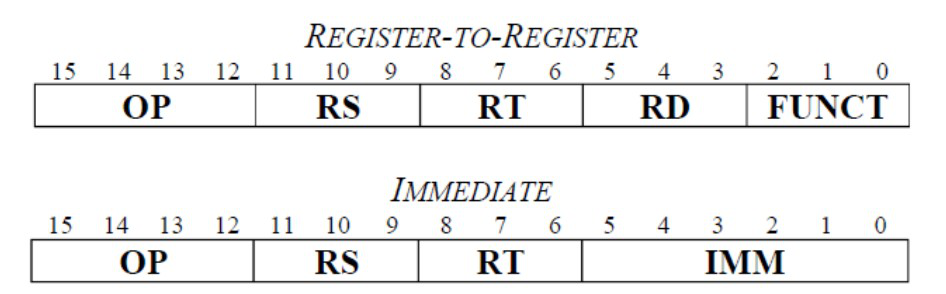
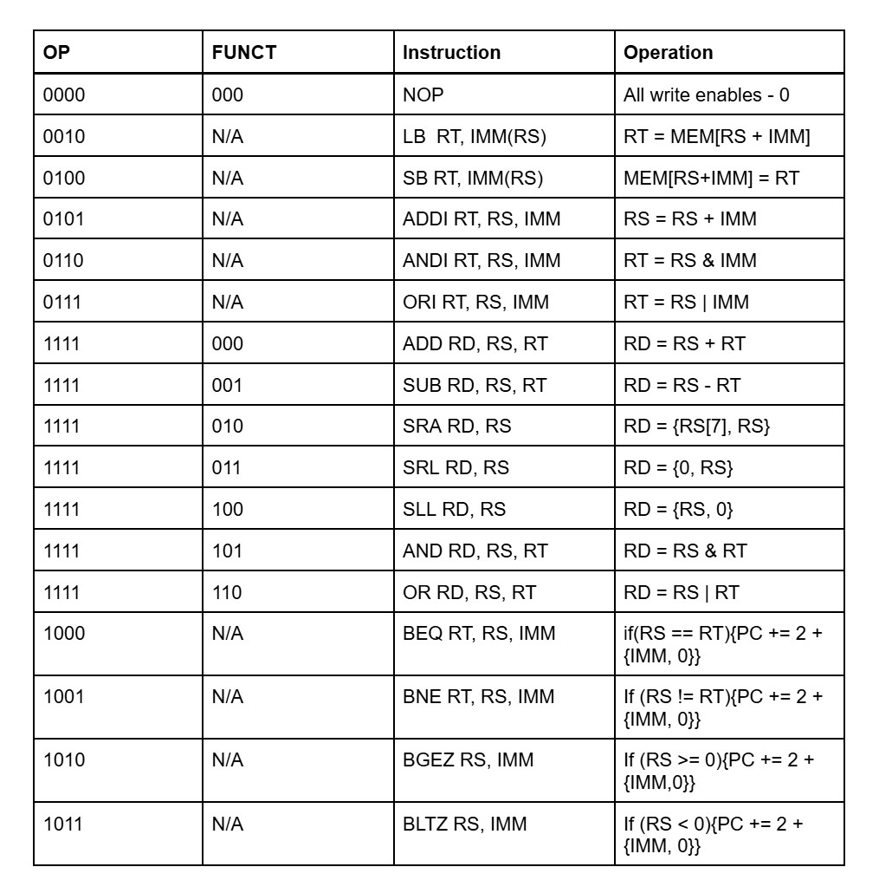

## Table of Contents
- [Instruction Set](#instruction-set)

## Instruction Set

Each instruction has a 4-bit opcode OP, and has register fields that are 3 bits wide (RS, RT, and in the case of register-to-register, RD). The register-to-register instructions also include a 3-bit function field, FUNCT, which is sent to the FS input of the ALU. Immediate instructions contain a 6-bit constant, IMM, instead.

  

Instruction Format

These are all the currently supported instructions for this microprocessor:

  

Instruction Set
