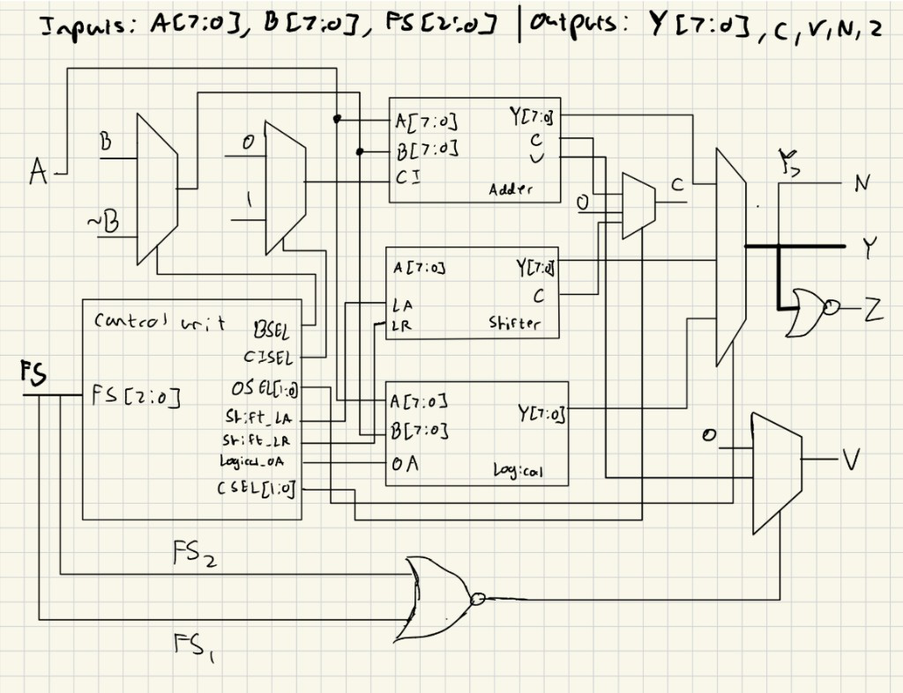
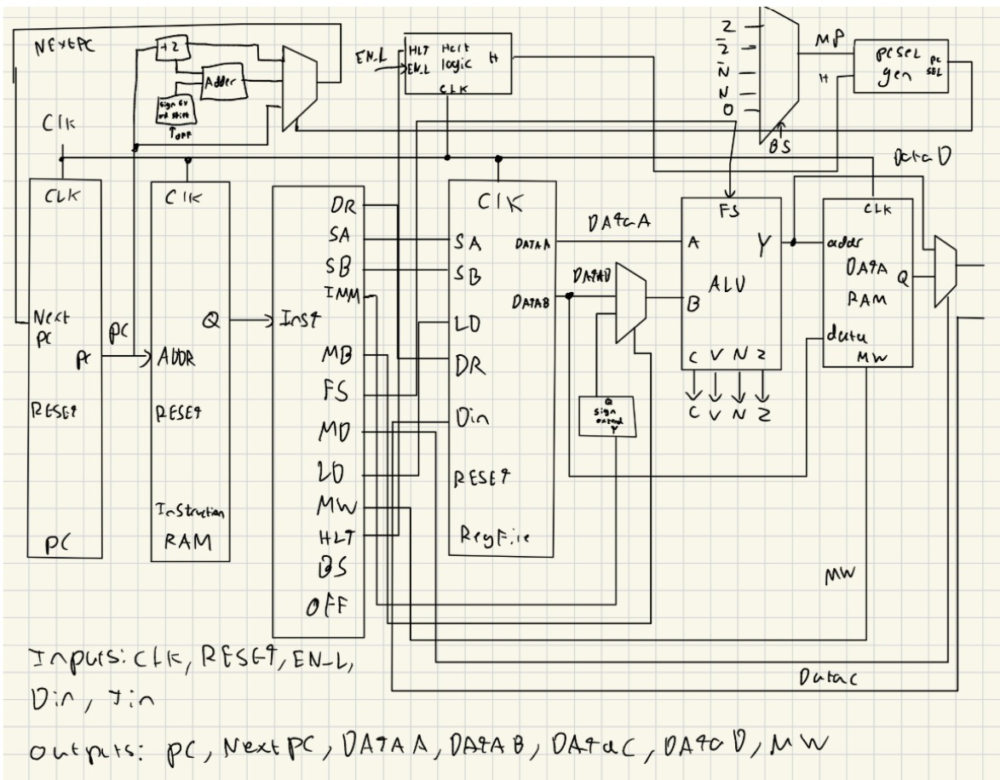

## Table of Contents
- [ALU Architecture](#alu-architecture)
- [microprocessor architecture](#microprocessor-architecute)

## ALU Architecture

  

ALU Implementation

The ALU(Arithmetic Logic Unit), is a module that takes in two eight-bit signals, A and B, and a 3 bit signal FS that controls what the ALU should do with signals A and B. The ALU outputs an 8-bit signal Y that is the result of performing the operation dictated by input signal FS on input signals A and B. Additionally, the ALU outputs 4 flags that are raised to high when certain behavior is exhibited in the operation. The first flag, C, is raised to high when the Operation results in a carry out bit, the second flag V is raised when the operation results in overflow, the third flag N is raised when the output Y is a negative number, and the fourth flag Z is raised when the output Y is zero.

The ALU needed to support 8 instructions: Addition, Subtraction, Arithmetic Right Shift, Logical Right Shift, Logical left shift, Bitwise AND, and Bitwise OR. To implement these 8 instructions, I composed the ALU of 3 modules: an adder, a shifter, and a logical unit, whose control signals were controlled by a decoder I implemented. 

As shown in Figure 1, the decoder or control unit determines the necessary control signals for each module based on what operation is being done (FS). For example, if we are doing subtraction, the control unit sets BSEL to 1, as we must add ~B and CISEL to 1, as we must also input a carry-in of 1 to the adder. OSEL would be set to 00, as we want to select the output of the adder, and CSEL is set to 00 as we select the carry out of the adder. Similarly, for the other 7 instructions, the control unit determines control signals accordingly. 

The adder module was implemented by instantiating a 1-bit adder that added two 1-bit signals A and B and s 1-bit carry-in signal, and then instantiating 8 of these 1-bit adders for each bit in A and B, where the carry out of 1 adder would be the carry in of the next one. The carry in of the first adder was provided by input CI in the ALU. This was a ripple-carry adder implementation that was used for the adder module. The shifter and logical modules were implemented by assigning and performing operations on individual bits.

As to how the flags of the ALU were generated, the carry out flag is generated by selecting between the carry out of the three modules using a multiplexer. The Negative flag is just the most significant bit of the 8-bit signal Y, as in two’s-complement representation, an MSB of 1 indicates a negative number. The Zero flag is raised by doing a NOR operation on each individual bit of the 8-bit output signal Y. The overflow flag is raised by selecting the overflow output of the adder if we are doing an operation that involves the adder (addition or subtraction), or else it is 0. We check this by making the select signal of the mux a NOR operation of the two most significant bits of FS, as only addition and subtraction have the two most significant bits of FS as 00. 

## Microprocessor Architecture

  

Microprocessor Implementation

For the microprocessor, PC was fed as an input into the Instruction RAM and an output instruction Q was outputted. This output was inputted into the decoder, which determines all the necessary control signals. This is connected to the register file, the ALU, and the data RAM, and certain combinations of signals resulted in different operations, such as performing operations on two source registers and storing the value in a destination register, loading data from the data RAM, storing data from the data RAM, and more. Note that the immediate(IMM) was sign-extended with a sign extension module. Additionally, this microprocessor has the ability to halt as the halt logic module takes an input of HLT and EN_L and raises PCSEL to 1 if HLT is high and EN_L does not make a transition from 1 to 0. PCSEL is then the select signal of a multiplexer that stops incrementing PC by 2, hence halting the instruction sequence. 

As to how branching was implemented, note the two outputs on the decoder, BS and OFF. BS was the branch select that determines for what condition it should branch, such as if RS == RT or if RS >= 0. I decided to implement this branch selection capability with a multiplexer. To implement BEQ and BNE, I chose output signals on the decoder that performed a subtraction of RS and RT (RS = RT), and then connected the zero flag and the inverted zero flag to the multiplexer. Therefore, to check BEQ, the zero flag would be set to 1 if RS and RT were equal, and for checking BNE, the inverted zero flag would be set to 1 if RS and RT were not equal, as RS-RT would not result in zero in that case.

To implement BGEZ and BLTZ, I decided to control our decoder outputs so that it performed an SRA (right arithmetic shift). This is because I wanted to use an operation that preserved the most significant bit of RS. Then, I just connected the inverted negative flag and normal negative flag to the multiplexer, as for BGEZ, if RS >= 0, then the inverted negative flag would raise to 1 as the number is not negative, and for BLTZ, the negative flag would raise to 1 if RS < 0. 

Then, the PCSEL was used as the select signal to a multiplexer that selected between incrementing PC by 2, incrementing PC by 2 + OFF, and halting. The PCSEL was generated with a multiplexer that selected the branch based on the output of HaltLogic and MP, the output of the flags multiplexer. Then PCSEL selected the right increment logic based on whether we were branching, and therefore branching was successfully implemented in the microprocessor.
